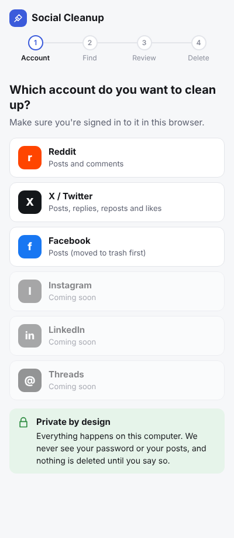
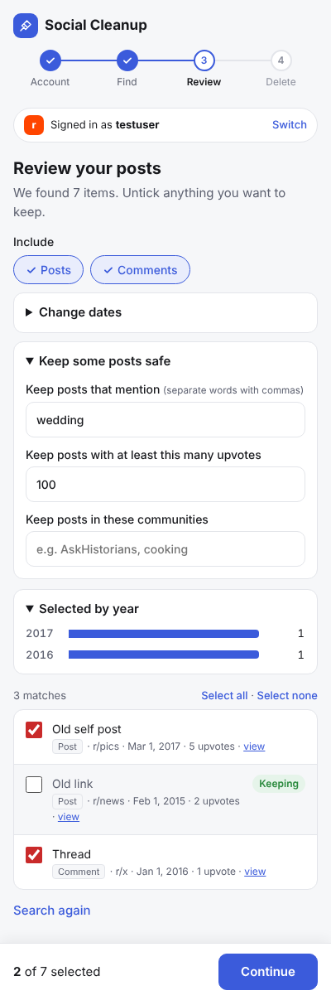
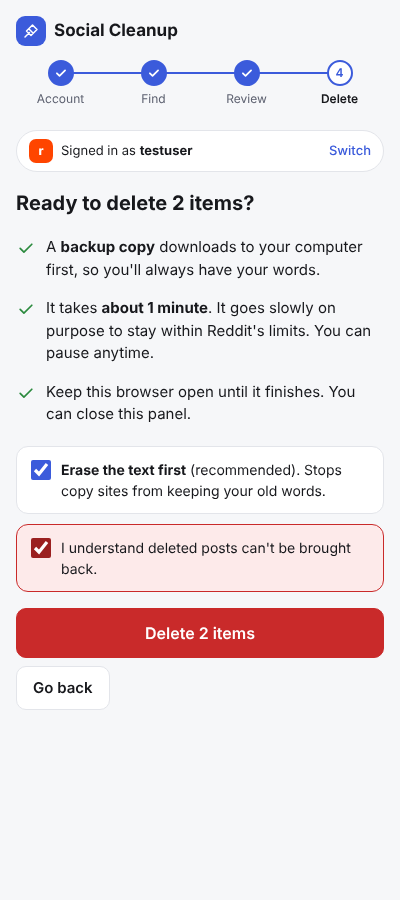
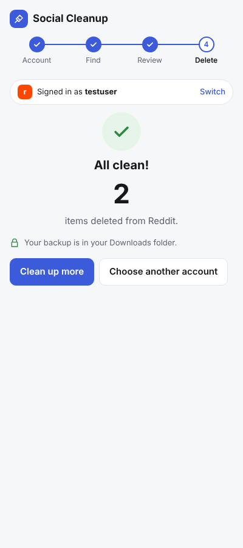

# Social Cleanup

**Delete your old social media posts in bulk, in a few clicks.**

Social Cleanup is a free browser extension. You pick an account, choose how far back to go ("everything older than 3 years", for example), review the list, and it deletes them for you, saving a backup copy first.

It runs entirely on your own computer. It never asks for your password, and nothing is sent anywhere except the delete requests to the site itself.

| Site | What it can delete |
|---|---|
| **Reddit** | Posts and comments |
| **X / Twitter** | Posts, replies, reposts and likes |
| **Facebook** | Posts (moved to Facebook's trash first, so you have 30 days to change your mind) |

Instagram, LinkedIn and Threads are planned.

<p>
  
  
  
  
</p>

> **Early version.** Social Cleanup is tested thoroughly against realistic copies of each site, but not yet against the live sites. Please try it on a few posts first.

## Install

Works in **Chrome, Edge, Brave** and other Chromium browsers on a computer (not phones).

1. Go to the [**Releases**](../../releases/latest) page and download `social-cleanup-….zip`.
2. Unzip it. You'll get a folder called `social-cleanup`.
3. In your browser, open **`chrome://extensions`** (type it into the address bar).
4. Turn on **Developer mode** (switch in the top-right corner).
5. Click **Load unpacked** and choose the `social-cleanup` folder.
6. Click the puzzle-piece icon in the toolbar and pin **Social Cleanup**.

"Developer mode" just lets you install extensions that aren't from the Chrome Web Store. A Web Store version may come later.

## How to use it

Click the **Social Cleanup** icon to open the panel, then follow the four steps:

1. **Account:** pick the site. Make sure you're signed in to it in the same browser.
2. **Find:** choose a time range like *Older than 1 year* or *Everything*. Nothing is deleted yet.
3. **Review:** see everything that was found. Untick anything you want to keep, or use *Keep some posts safe* to protect posts that mention certain words.
4. **Delete:** confirm, and a backup downloads first. Then it works through your posts in the background. You can pause, stop or close the panel; just keep the browser open.

### X / Twitter: one extra step

X only shows your newest ~3,200 posts, so Social Cleanup uses the copy of your data that X gives you:

1. On x.com, go to **Settings → Your account → Download an archive of your data**.
2. X emails you when it's ready (often a day or more). Download the `.zip`.
3. Drop the `.zip` into the Social Cleanup panel. It's read on your computer only.

## Privacy and security

- **Nothing leaves your computer** except the delete requests sent straight to the site you're cleaning up. No servers, no analytics, no tracking.
- **No passwords and no API keys.** It uses the session you already have open in your browser.
- **Minimal permissions.** It can only access reddit.com, x.com / twitter.com and facebook.com. It can't see any other site you visit.
- **Websites can't control it.** Only the extension's own panel can start or change a cleanup.
- **Your list of posts is wiped** from the extension when you start over or switch account. The backup files in your Downloads folder are yours to keep or delete.

These protections are checked by automated tests on every change.

## FAQ

**Can I undo a deletion?**
Not on Reddit or X: deleted is deleted. That's why a backup downloads first. On Facebook, posts go to the trash, and you can restore them for 30 days.

**Why is it slow?**
On purpose. Each site limits how fast you can delete things, so Social Cleanup works at a steady pace well within those limits. Thousands of posts can take a few hours. You can leave it running in the background.

**Is this allowed?**
You're deleting your own posts from your own account. Some sites' terms discourage automated tools, so use it at your own discretion.

**It says it can't find the delete option on Facebook.**
Facebook changes its website often, and this version only understands Facebook in English. Check here for a newer version, or [open an issue](../../issues).

**Something else went wrong.**
The panel tells you what to try. If it keeps happening, please [open an issue](../../issues) and include what the panel said (under *Technical details*). Never include passwords or personal posts.

## Known limitations

- Facebook support relies on the English version of Facebook's website.
- On X, the archive doesn't record *when* you liked something, so date ranges for likes use the date of the liked post.
- Reddit only lists about 1,000 items at a time. Very large accounts may need a second run to catch stragglers.
- Deleting stops while the browser is closed and picks up when it's reopened.

---

## For developers

No build step: it's plain JavaScript. Edit the files, then click the reload icon on `chrome://extensions`.

```bash
npm test          # unit + security tests
npm install       # once, for the end-to-end tests (Playwright)
npm run test:e2e  # loads the real extension in Chromium against fake Reddit, X and Facebook
npm run package   # builds dist/social-cleanup-<version>.zip for a release
```

```
Side panel UI  ──messages──▶  Background worker  ──messages──▶  Content script in the site's tab
(src/sidepanel)               (src/background)                 (src/adapters/<site>.js)
                              job queue, pacing,                talks to the site using your
                              progress in chrome.storage        existing logged-in session
```

- **Adapters** (`src/adapters/`) are the only site-specific code. Each implements `checkLogin()`, `listPage()` and `deletePost()`. To add a site, write an adapter and register it in `manifest.json` and `src/shared/platforms.js`.
- **The job manager** (`src/background/jobManager.js`) saves progress after every item, so a job survives the browser restarting its background worker.
- **The side panel** (`src/sidepanel/`) renders from the job state in `chrome.storage`.
- Facebook's button labels live in `SEL` / `TEXT` at the top of `src/adapters/facebook.js`, so they're quick to update when Facebook changes its page.

Contributions are welcome: please run `npm test` before opening a pull request.

## License

[MIT](LICENSE)
